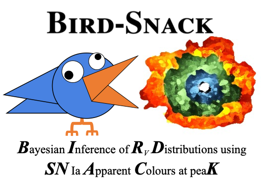

# Bird-Snack
**B**ayesian **I**nference of **R**v **D**istributions using **SN** Ia **A**pparent **C**olours at pea**K**
---

This pipeline uses:

1) [**SNooPy**](https://csp.obs.carnegiescience.edu/data/snpy) to apply K-corrections and Milky Way extinction corrections to SN Ia light curves.
2) A 2D Gaussian process to interpolate rest-frame photometry to peak time.
3) A hierarchial Bayesian model to constrain population distributions in intrinsic and extrinsic components.

To get started, build a new conda environment using instructions in [**installation.txt**](https://github.com/sam-m-ward/birdsnack/blob/dev/installation.txt).

Check out [**demo_notebook.ipynb**](https://github.com/sam-m-ward/birdsnack/blob/dev/demo_notebook.ipynb) for a quick introduction to how Bird-Snack works.

See also [**demo_sbc_ppc.ipynb**](https://github.com/sam-m-ward/birdsnack/blob/dev/demo_sbc_ppc.ipynb) for introduction to simulating and fitting fake datasets with Bird-Snack.

---

