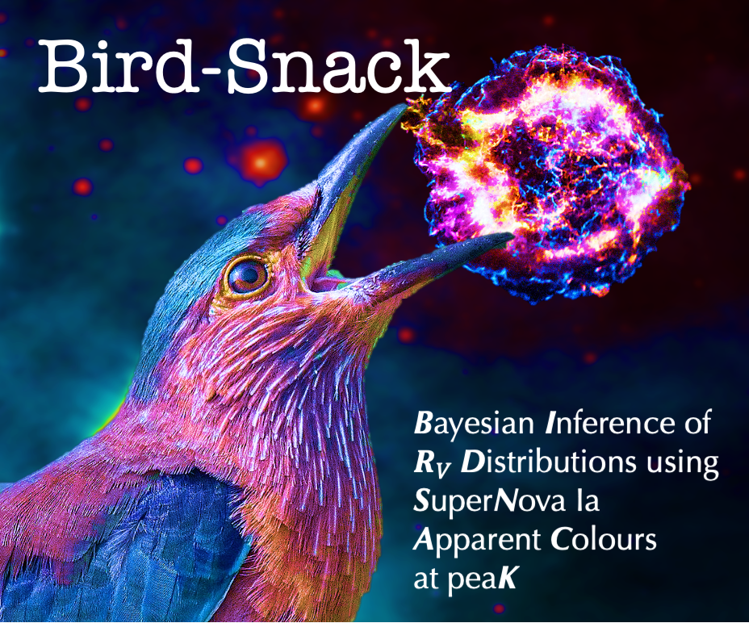

# Bird-Snack
**B**ayesian **I**nference of **R**v **D**istributions using **SN** Ia **A**pparent **C**olours at pea**K**
---

Bird-Snack is a modular pipeline for rapid hierarchical Bayesian inference of Type Ia supernova (SN Ia) host galaxy dust distributions. It estimates SN Ia apparent magnitudes at time of peak brightness, and decomposes them into intrinsic, extrinsic and achromatic contributions. Bird-Snack facilitates rapid exploration of custom analysis choices, and quick fits to simulated datasets, for better interpretation of real-data inferences.   

This pipeline uses:

1) [**SNooPy**](https://csp.obs.carnegiescience.edu/data/snpy) to apply K-corrections and Milky Way extinction corrections to SN Ia light curves.
2) A 2D Gaussian process to interpolate rest-frame photometry to peak time.
3) A [**hierarchical Bayesian model**](https://github.com/sam-m-ward/birdsnack/blob/main/model_files/stan_files/deviations_model_fit_mags_Gaussianmuintref.stan) to constrain population distributions in intrinsic and extrinsic components.

## Getting Started

Build a new conda environment using instructions in [**installation.md**](https://github.com/sam-m-ward/birdsnack/blob/main/installation.md).

Check out [**demo_notebook.ipynb**](https://github.com/sam-m-ward/birdsnack/blob/main/demo_notebook.ipynb) for a quick introduction to how Bird-Snack works.

See also [**demo_sbc_ppc.ipynb**](https://github.com/sam-m-ward/birdsnack/blob/main/demo_sbc_ppc.ipynb) for introduction to simulating and fitting fake datasets with Bird-Snack.

## Acknowledgements

Bird-Snack was developed by Sam M. Ward (@sam-m-ward). Please cite [**Ward et al. 2023**](https://arxiv.org/abs/2310.07753), *MNRAS*, when using this code.

This repo builds on [**SNooPy**](https://csp.obs.carnegiescience.edu/data/snpy), applies the methods from [**avocado**](https://github.com/kboone/avocado) for Gaussian process regression with [**george**](https://george.readthedocs.io/en/latest/), and uses [**BayeSN**](https://github.com/bayesn/bayesn-public) to generate SED-integrated datasets, and interact with snana light curve files.

---
